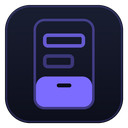

<div align="center">



# G9MAUIControls

**A dependency-light .NET MAUI control suite built entirely on public MAUI primitives.**

[](https://www.nuget.org/packages/G9MAUIControls)
[](https://www.nuget.org/packages/G9MAUIControls)
[](LICENSE)
[](https://dotnet.microsoft.com/)
[](#)

</div>

25+ input and feedback controls sharing one outlined-field architecture, a bottom sheet with real
per-platform edge-handoff gestures, a popup system, toasts, an animated tab bar, an edge drawer, and a
~110-token light/dark theme engine.

No reflection. No shadows — a measured software-blur ANR hazard, see `AiGuides/`. RTL-correct.
Trim-analyzer clean. Bring your own icon font; no icon package is required.

## Packages

| | Package | What it adds | Why it is separate |
|---|---|---|---|
|  | [**G9MAUIControls**](https://www.nuget.org/packages/G9MAUIControls) | The core: controls, theming, hosting, bottom sheets, popups, toasts | — |
|  | [**.Barcode**](https://www.nuget.org/packages/G9MAUIControls.Barcode) | Barcode text entry with an integrated camera scan surface | Camera scanning costs a native camera stack, a permission and a store privacy declaration |
|  | [**.IntroCarousel**](https://www.nuget.org/packages/G9MAUIControls.IntroCarousel) | Onboarding carousel with pagination and a skip/next flow | Product-shaped: most apps show it once, many never |
|  | [**.ProgressOverlay**](https://www.nuget.org/packages/G9MAUIControls.ProgressOverlay) | Blocking progress overlay with determinate and indeterminate modes | Owns a full-window host layer the core does not require |
|  | [**.Persistence.Sqlite**](https://www.nuget.org/packages/G9MAUIControls.Persistence.Sqlite) | SQLite persistence with audit columns and migrations | Pulls in SQLite; a UI suite must not impose a database |

```pwsh
dotnet add package G9MAUIControls
```

The five ship as **one version** and move together (`AiGuides/10-Decisions.md`, ADR-0010) — a stable
package cannot depend on a prerelease one, so the family crosses as a set.

## Status

**1.0.0 — stable.** These controls are not new code: they have been carrying a production application
for a long time. What is new is the package boundary, and it has now been driven end to end by that same
application on Android — ~51,000 lines of consumer code across every seam, on a device. That pass found
21 defects, six of which nothing but running the app could have found; all are fixed in this release.

Verified on **Android**. iOS, Mac Catalyst and Windows build, pack and pass the trim analyzer, but have
not been rendered and looked at. `AiGuides/09-Progress.md` keeps that gap list current and honest —
it is a gap in verification breadth, not a known defect.

## Repository layout

```
├── Directory.Build.props        shared package metadata + G9FamilyVersion (the ONE version)
├── Directory.Packages.props     Central Package Management for the whole subtree
├── G9MauiLibrary.props          the shared MAUI-library project shape (imported by the satellites)
├── nuget.config                 clears inherited feeds so nothing global shadows a local pack
├── global.json                  SDK pin
├── azure-pipelines.yml          build → pack → mirror to GitHub → publish to nuget.org
├── G9MAUIControls.slnx          the solution: 5 packages + the gallery
│
├── AiGuides/                    ← the shared guides. START HERE. See below.
├── G9MAUIControls/                    core        ← README.md + 26 per-control guides
├── G9MAUIControls.Barcode/            satellite   ← README.md + control guide
├── G9MAUIControls.IntroCarousel/      satellite   ← README.md + control guide
├── G9MAUIControls.ProgressOverlay/    satellite   ← README.md
├── G9MAUIControls.Persistence.Sqlite/ satellite   ← README.md
│
└── G9Controls.Gallery/          verification app — every control, both themes, both directions,
                                 and the package-reference consumer (-p:UseG9Packages=true)
```

Do not lift the five `G9MAUIControls*/` project folders out on their own: they will not build, because
the props files, the CPM manifest and the SDK pin they need live at this root rather than inside them.

> Self-contained means *rooted here*. It does **not** mean this config follows the projects into a
> consumer: NuGet resolves settings from the directory that DRIVES the restore, so when a consuming
> solution restores these projects, the `nuget.config` here is not in the chain and the consumer's own
> sources apply. Only what lives in the project files travels. See LES-0030.

## Where the documentation lives, and why it is not per-project

**Two tiers, on purpose.**

- **`AiGuides/` is shared and stays at this root.** It governs the whole subtree — architecture, the
  ADRs, the engineering log, progress. Copying it into each of the five projects would create 55 files
  that drift apart within a week, and none of them would be authoritative.
- **Per-package documentation lives inside its package**, and travels into the `.nupkg`: each project's
  `README.md` (the nuget.org page), plus the core's `Controls/G9Controls.md` and the 26 per-control /
  per-subsystem guides beside the code they describe.

**Only `README.md` is packed.** The `AiGuides/` and per-control `.md` files are source-tree
documentation — a package consumer gets the README and the XML docs, not the guides. That is
intentional, but it means anyone doing real work against this suite needs *this repository*, not the
packages.

### Reading order

1. `AiGuides/01-AIGuide.md` — entry point and the two rules that override instinct
2. `AiGuides/09-Progress.md` — where things actually stand, including what has not been run
3. `AiGuides/10-Decisions.md` — the ADRs
4. `G9MAUIControls/Controls/G9Controls.md` — §0 (no shadows, ever) and §15 (platform crash catalog)

## Build and pack

```pwsh
dotnet build G9MAUIControls.slnx -c Release           # Release: XAML only compiles in Release
dotnet pack  G9MAUIControls.slnx -c Release -o artifacts/pack
```

The family shares **one** version, defined once as `G9FamilyVersion` in `Directory.Build.props`.
Bump it on every content change — a NuGet version is an immutable identity, so re-packing changed code
under an unchanged version ships nothing and silently serves whatever is already extracted in
`~/.nuget/packages/`. (That mistake produced a green build that tested none of the new code; see
`AiGuides/11-EngineeringLog.md`, LES-0025.)

CI does the same on every push to `main`, then mirrors to GitHub and publishes. Because the version is
deliberate rather than computed, a re-run without a bump publishes nothing and passes.

## License

[MIT](LICENSE) — free for any use, including commercial. © 2026 Iman Kari.
